# Introduction

This project provides an integration of [R](http://r-project.org), which is a language for statistical computing and graphics, into [Intellij IDEA](https://www.jetbrains.com/idea/).

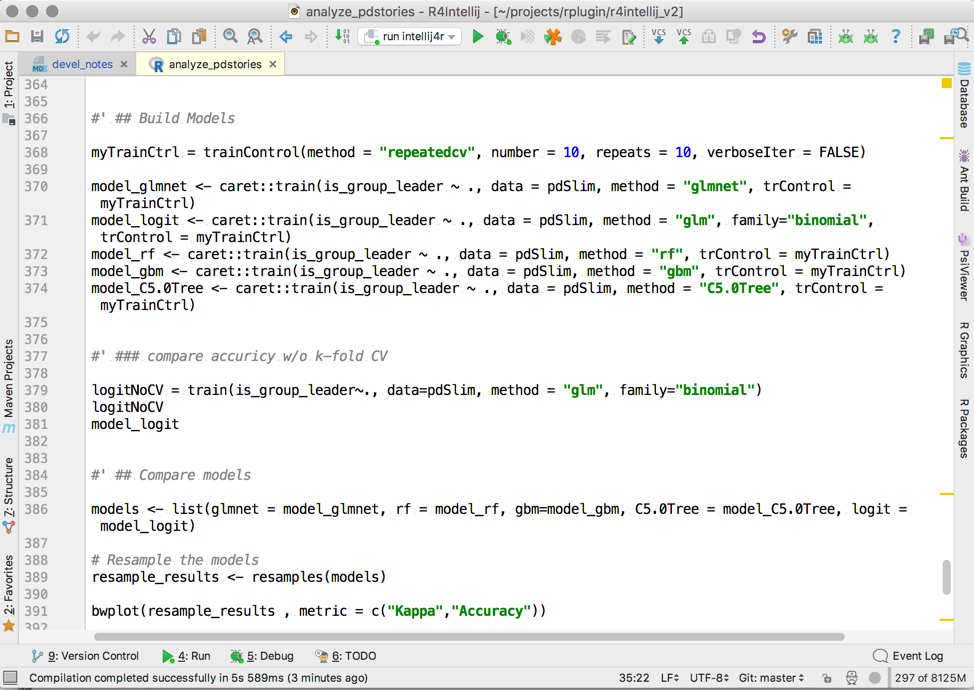

The plugin provides syntax highlighting, import-aware code completion, a powerful and customizable code formatter, refactorings to reshape existing code, smart indentation, automatic detection and quickfixes for common coding issues, and sophisticated means to navigate your code and installed packages. Furthermore, it integrates tightly with R help and documentation, includes an interactive debugger, and allows to execute R code in an integrated console.

[TOC]: # "Table of Contents"

# Table of Contents
- [Installation](#installation)
- [Support](#support)
- [Basic Usage](#basic-usage)
    - [File extensions](#file-extensions)
    - [Source code navigation](#source-code-navigation)
- [Interactive Console](#interactive-console)
- [Code completion](#code-completion)
- [Refactoring](#refactoring)
- [Inspections](#inspections)
- [Intentions](#intentions)
- [Run configurations](#run-configurations)
- [Integrated Debugger](#integrated-debugger)
- [Package Manager](#package-manager)
- [Platform features](#platform-features)
- [Site navigation](#site-navigation)
- [Links](#links)

Installation
------------

1.  Get Intellij IDEA, which is available as pro and as free open-source community edition from [JetBrains](http://jetbrains.com).
2.  To install the plugin, just open the plugin manager in Intellij Idea, search for "R Language Support" , and finally click install.
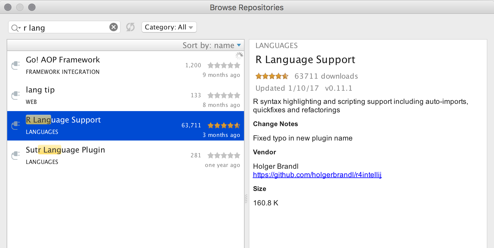

Support
-------

Feel welcome to report problems or suggest new features by adding an issue to our [tracker](https://code.google.com/p/r4intellij/issues/list). Or be a hero and send us a pull request.

<!-- You can also ask questions in the plugins [discussion forum](http://devnet.jetbrains.net/community/idea/plugins) of Intellij. Don't forget to tag your posts with the tag r4intellij (otherwise we might not read it). -->

Before you asked questions, you should consider to read our [FAQ](faq.md).

Basic Usage
-----------

Just drag an R script into idea and start hacking.

Create a R script from the projects tools window:

You can also create a new project (the type does not matter) and organize your work into modules with differen content roots. Read the Intellij [documentation](http://www.jetbrains.com/idea/webhelp/intellij-idea.html) for more details about to do so.

Implemented features are accessible by the default shortcuts of the Intellij platform where possible. Custom shortcuts can be assigned under `Preferences -> Keymap`.

### File extensions

By default the plugin supports these file extensions: `.R`.  IntelliJ offers the possibility to link so far unknown file extensions to a plugin. Just choose R4Intellij to open files with this newly registered file extension as R files.

### Source code navigation

The following features are supported 

*   Jump to declaration (of symbols and locally defined functions)
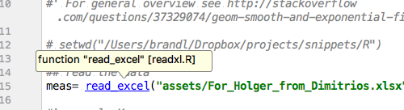
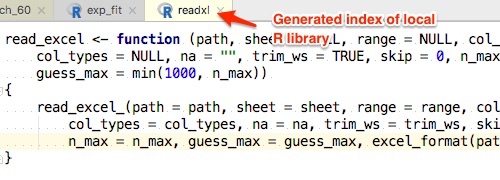

*   View --&gt; Quick Definition Lookup (of functions): This will show the signature and a short title

*   Search --&gt; Highlight Usage: This will make Intellij to highlight all locations where a function or a symbol is being used*   Brace matching: If you position the caret before or after a bracket then IntelliJ will highlight the other element of the pair of brackets.*   File Structure View: In the structure view IntelliJ shows the functions and code sections of the R script.

* Integration with R-Help: Simply invoke `F1` on any symbol (data-sets, package names, functions).

* Documentation lookup for user-defined functions
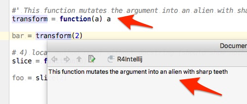

Interactive Console
-------------------

Start a new console under _Tools_

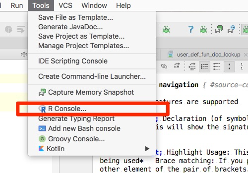

To push code from the editor use `Ctrl-Meta+Enter`. For a more general overview on how to use run consoles in IDEA see https://www.jetbrains.com/help/idea/2016.3/working-with-embedded-local-terminal.html

Note: You can also evaluate R code in an external console by means of the [Send To Terminal](https://plugins.jetbrains.com/plugin/9409-send-to-terminal) plugin for Intellij.

Code completion
---------------

R4Intellij builds an index of your local R installation which allows for much better completion, local error highlighting, integrated documentation lookup and more. Depending on the number of packages installed on your machine the initial indexing procedure will up to a few minutes. The plugin will refresh the index on startup to include newly installed packages.

The plugin will try to infer the location of R automatically from your environment (i.e. PATH). On most platforms it will guess it correctly, but you can adjust it if necessary in the preferences.

The following completion modes are available: 

*   Basic word completion for variables and local functions
*   Completion of names for loaded packages
*   Package name completion in library statements
*   Coming soon: setwd() aware path completion

Refactoring
-----------

All refactorings can be accessed via the "Refactor" menu

*   Renaming of symbols and functions

Inspections
-----------

Intentions are on-the-fly checks of your R scripts, that highlight problems and (optionally) suggest automatic quick fixes

* Detect not yet installed packages in import statements
* Detect missing arguments in method calls
* Detect missing package imports
* Detect unresolved references (variables that are not defined)
* Detect forward references (i.e. variables that are used before declaration)
* Detect unused variables and function arguments

Intentions
----------

Intentions are quick-fixes provided and executed by the the plugin.

* Auto-import of packages given a function name
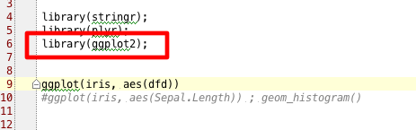

* Convert `T` to `TRUE` and `F` to `FALSE`

Run configurations
------------------

To run or a debug a script with in the IDE, simply right-click and choose "Run", "Debug", or "Create..."

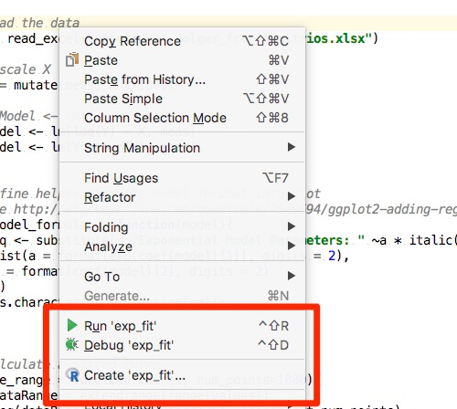

Once create, you can adjust the working direction, environment properties and other arugments passed on to R
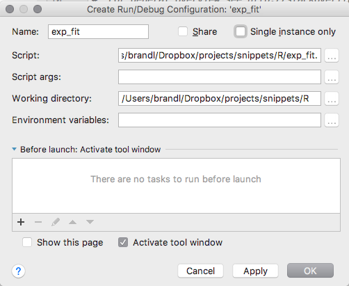

Existing run configuraitons can be invoked from the toolbar
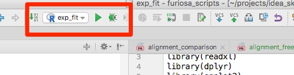

Integrated Debugger
-------------------

To create a breakpoint simply click left from the editor:
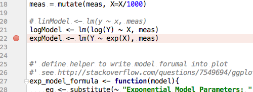

See the previous section about how to create run configuraiton and to run those in debug mode. When stopping at a breakpoint the IDE will show a listing of current environment variables including their types, as well as a console with current output.
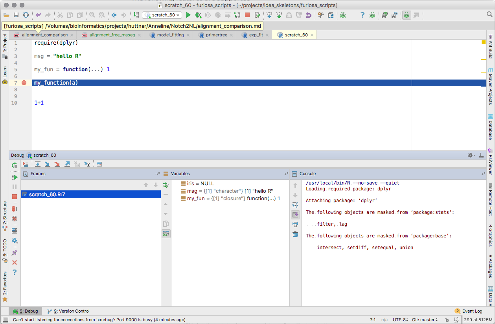

Package Manager
---------------

Packages can be installed from the "R Packages" tool window.

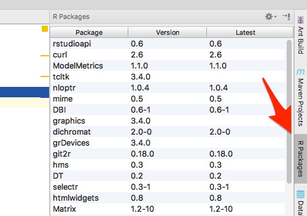

There you can also update existing packages if needed.

Platform features
-----------------

The main strength of our plugin is the underlying Intellij IDE. So if you have not worked with it before, read more about all its amazing [features](http://www.jetbrains.com/idea). It ships with everything from SCM integration (Git, Subversion, etc.), neat SQL integration, bash scripting support, and so many more interesting features. However, its main "feature" is its usability. Give it a try!

Site navigation
---------------

* [Development notes](https://github.com/holgerbrandl/r4intellij/blob/master/misc/devel_notes.md)
* [Release History](https://github.com/holgerbrandl/r4intellij/blob/master/Changes.md)
* [FAQ](faq.md)

Links
-----

Other R-IDEs
* [StatET](http://www.walware.de/goto/statet)
* [RStudio](http://rstudio.org/`)
* [R Tools for Visual Studio](https://blogs.technet.microsoft.com/machinelearning/2016/03/09/announcing-r-tools-for-visual-studio-2/)
