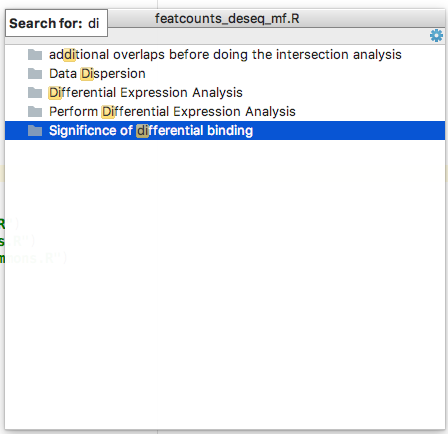
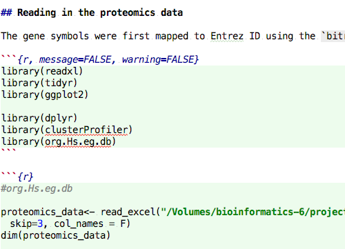
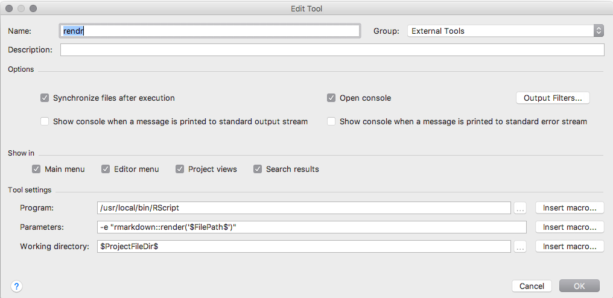

# Introduction

This project provides an integration of [R](http://r-project.org), which is a language for statistical computing and graphics, into [Intellij IDEA](https://www.jetbrains.com/idea/).

The plugin provides syntax highlighting, import-aware code completion, a powerful and customizable code formatter, refactorings to reshape existing code, smart indentation, automatic detection and quickfixes for common coding issues, and sophisticated means to navigate your code and installed packages. Furthermore, it integrates tightly with R help and documentation, includes an interactive debugger, and allows to execute R code in an integrated console.

[TOC]: # "Table of Contents"

# Table of Contents
- [Installation](#installation)
- [Support](#support)
- [Basic Usage](#basic-usage)
- [Source code navigation](#source-code-navigation)
- [Structure View](#structure-view)
- [Interactive Console](#interactive-console)
- [Code completion](#code-completion)
- [Refactorings](#refactorings)
- [Inspections](#inspections)
- [Intentions](#intentions)
- [Run Configurations](#run-configurations)
- [Integrated Debugger](#integrated-debugger)
- [Package Manager](#package-manager)
- [RMarkdown Support](#rmarkdown-support)
- [Platform features](#platform-features)
- [Site navigation](#site-navigation)
- [Links](#links)

Installation
------------

1.  Get [Intellij IDEA](https://www.jetbrains.com/idea/), which is available as pro and as free open-source community edition from [JetBrains](http://jetbrains.com).
2.  To install the plugin, just open the plugin manager in Intellij Idea, search for "R Language Support", and finally click install.

After you have restarted IDEA, the plugin will build an index of your local R package library, which allows for enhanced [code completion](#code-completion),  [error highlighting](#inspections), integrated [documentation lookup](#source-code-navigation) and more. Depending on the number of packages in your R library the initial indexing procedure will require up to a few minutes to complete. The plugin will refresh this index on each IDE startup.

The plugin will try to infer the installation path of R automatically from your environment (e.g. PATH). On most platforms it will guess it correctly, but you can also set the path of the used R interpreter in the plugin preferences (_Settings_->_Custom Languages_->_R_).

Support
-------

Feel welcome to ask questions, to report problems or to suggest new features by creating a ticket in our [issue tracker](https://code.google.com/p/r4intellij/issues/list). Before doing so, please check out [FAQ](faq.md).

Or be a hero and send us a [pull request](https://github.com/holgerbrandl/r4intellij/pulls). :-)

<!-- You can also ask questions in the plugins [discussion forum](http://devnet.jetbrains.net/community/idea/plugins) of Intellij. Don't forget to tag your posts with the tag r4intellij (otherwise we might not read it). -->

Basic Usage
-----------

Just drag an R script into idea and start hacking.

Create a R script from the projects tools window:

You can also create a new project (the type does not matter) and organize your work into modules with different content roots. Read the Intellij [documentation](http://www.jetbrains.com/idea/webhelp/intellij-idea.html) for more details about how to do so.

By default the plugin is set to just work with files using the suffix `.R`.  However, IntelliJ allows to associate file extensions to plugins (see _Preferences_->_Editor_->_File Types_).

## Source code navigation

The following features are supported 

*   Jump to declarations of symbols and locally defined functions with `Meta+Click`. For example when being applied to a `read_excel` call, the IDE will navigate to the corresponding function declaration in the internally generated [package index](#installation):

*   _View_ -> _Quick Definition Lookup_ (of functions): This will show the signature and a short title

*   _Search_ -> _Highlight Usage_: This will make Intellij to highlight all locations where a function or a symbol is being used
*   Brace matching: If you position the caret before or after a bracket then IntelliJ will highlight the other element of the pair of brackets.
* Integration with R-Help: Simply invoke `F1` on any symbol (data-sets, package names, functions).

* Documentation lookup for user-defined functions

Structure View
--------------

The plugin provides a [Structure View](https://www.jetbrains.com/help/idea/2017.1/structure-tool-window-file-structure-popup.html) which is accessible as a separate [tool window](https://www.jetbrains.com/help/idea/2017.1/tool-windows.html) or as a popup with `Alt+F12`. It allows to quickly jump to sections and functions definitions in the current script via narrow-down as you type search:

The sections are extracted based on the same model as used by [knitr::spin](https://www.rdocumentation.org/packages/knitr/versions/1.15.1/topics/spin). Headers are introduced by `#' # Title` , sections with `#' ## Section` and so on.

Interactive Console
-------------------

Start a new console under _Tools_

To push code from the editor to the console use `Ctrl+Meta+Enter`. The IDE will either send the current code selection, or the most top-level expression at the caret.

You can also evaluate R code in an external console by means of the [Send To Terminal](https://plugins.jetbrains.com/plugin/9409-send-to-terminal) plugin for Intellij. This allows to interactively use R on remote machines via ssh.

It is possible to run multiple consoles in parallel which will use separated R instances internally. This is handy to quickly switch between projects or when using [scratch files](https://www.jetbrains.com/help/idea/2017.1/scratches.html)

For a more general overview on how to use run consoles in IDEA see https://www.jetbrains.com/help/idea/2016.3/working-with-embedded-local-terminal.html

Code completion
---------------

The following completion modes are available: 

*   Basic word completion for variables and local functions
*   Completion of names for loaded packages
*   Package name completion in library statements
*   Coming soon: setwd() aware path completion

Refactorings
------------

All refactorings can be accessed via the _Refactor_ menu

*   Renaming of symbols and functions

Inspections
-----------

Inspections are on-the-fly checks of your R scripts, that highlight problems and (optionally) suggest automatic quick fixes

* Detect not yet installed packages in import statements
* Detect missing arguments in method calls
* Detect missing package imports
* Detect unresolved references (variables that are not defined)
* Detect forward references (i.e. variables that are used before declaration)
* Detect unused variables and function arguments

Intentions
----------

Intentions are quick-fixes provided and executed by the plugin.

* Auto-import of packages given a function name

* Convert `T` to `TRUE` and `F` to `FALSE`

Run Configurations
------------------

To run or a debug a script with the IDE, simply right-click and choose _Run_, _Debug_ to run immediately, or select _Create..._ a run-configuration .

Once created, you can adjust the working directory, environment properties and other arguments passed on to R in the _Run Configuration_ window.

Existing run configurations can be invoked from the toolbar

Integrated Debugger
-------------------

To set or remove breakpoints simply click left from the editor:

See the previous section about how to create [run configurations](#run-configurations) to run your scripts those in debug mode. When stopping at a breakpoint the IDE will show a listing of current environment variables including their types, as well as a console with current output.

You can then step through your code line by line, jump into or over function calls.

Package Manager
---------------

Packages can be installed from the "R Packages" tool window.

There you can also update existing packages if needed. Both CRAN and Bioconductor are supported.

RMarkdown Support
-----------------

Markdown support is available for Intellj IDEA as a [separate plugin](https://plugins.jetbrains.com/plugin/7793-markdown-support). Because of the ability to do [language injection](https://www.jetbrains.com/help/idea/2017.1/using-language-injections.html), R support is provided in [Rmarkdown](http://rmarkdown.rstudio.com/) code chunks

Reports can be rendered using a dedicated tool, which can be configured as needed.

Alternatively you can also use [run configurations](#run-configurations) to render Rmarkdown.

Platform features
-----------------

The main strength of our plugin is the underlying Intellij IDE. So if you have not worked with it before, read more about all its amazing [features](http://www.jetbrains.com/idea). It ships with everything from SCM integration (Git, Subversion, etc.), neat SQL integration, bash scripting support, and so many more interesting features. However, its main "feature" is its usability. Give it a try!

Site navigation
---------------

* [Development notes](https://github.com/holgerbrandl/r4intellij/blob/master/misc/devel_notes.md)
* [Release History](https://github.com/holgerbrandl/r4intellij/blob/master/Changes.md)
* [FAQ](faq.md)

Links
-----

Other R-IDEs

* [StatET](http://www.walware.de/goto/statet)
* [RStudio](http://rstudio.org/`)
* [R Tools for Visual Studio](https://blogs.technet.microsoft.com/machinelearning/2016/03/09/announcing-r-tools-for-visual-studio-2/)
