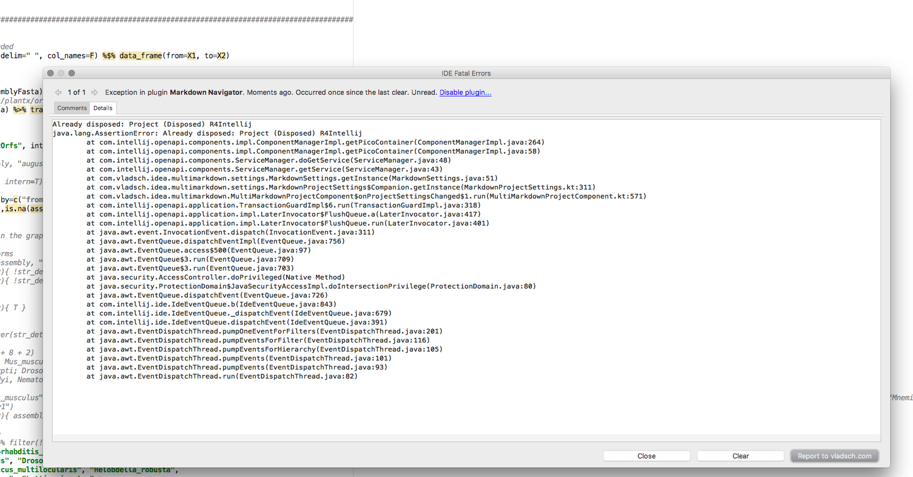

R4Intellij Development Notes
=============================

0-day bugs
----------

* disabled inspections are reenabled after startup
* find solution to [vcf refresh issue](https://intellij-support.jetbrains.com/hc/en-us/community/posts/115000160310-VFS-does-not-pick-up-changes-made-outside-of-VFS-when-doing-asynchRefresh)

Next Steps
----------


v1.1
----

* missing argument code is not flagged/incorrect argument is not flagged in
```
write_tsv(gplot$data, file=paste0(fileBaseName, ".txt"))
```

* Remove deprecated api usage

* embed custom error reporting service 

* fix gradle build to include resource files in zip (see https://github.com/JetBrains/gradle-intellij-plugin/issues/180#issuecomment-280377767) 
    * also use gradle for EAP releases (see https://intellij-support.jetbrains.com/hc/en-us/community/posts/115000113284-EAP-channel-for-plugins)
    
* [parameter info](https://intellij-support.jetbrains.com/hc/en-us/community/posts/206791995-Parameter-Info)

* better error recovery in parser (see https://github.com/JetBrains/Grammar-Kit#attributes-for-error-recovery-and-reporting)
* more rigorous unit test for [operator presedence](https://stat.ethz.ch/R-manual/R-devel/library/base/html/Syntax.html)

* make help window to show help even if caret is moved (auto-update from source disabling might be broken?)
* good code is gray: in ```c("foo"=3)``` see `com.r4intellij.parser.UnquotedVariablesTest._testQuotedNameInVector`


* function expression inlining is broken
```
train_glm = function(trainData){   train(is_group_leader ~ ., data = trainData, trControl = trainCtrl, method = "glm")}

list(
pdModel = train_glm
)
```

* bug: just first unquoted arg is tagged as such
```
flyGeneInfoSlim = transmute(
    TargetID=ensembl_gene_id,
    Description=description,
    ChromosomalLocation=paste0(chromosome_name, ":", start_position, "-", end_position)
)
```

## v1.2

* provide help for `tidy<caret>r::separate`

* http://www.jetbrains.org/intellij/sdk/docs/reference_guide/custom_language_support/additional_minor_features.html


Intentions & inspections
------------------------


### call arguments 
 
* add intention to name function argument (just current or all in function call)

* intention to add unresolved arg in function expression as named parameter
 

* bug: no warning if too many args are provided
```
log(1,2,3,4)
```

* intention to add name to named argument `myfun(34)` ->  `myfun(num_reps = 34)`  

### best practices & coding style

* inspection to replace `<-` with `=`
   
* intention to replace tidyverse imports with library(tidyverse)

* Intention to surround if expression list selection with curly brackets
    * "add braces for if/else statement" intention

* inspection: warn about usage of T and F
* warn if `base::atttach` is used (and suggest to rather use `with`)

* provide inspection/quickfix for incorrect NULL and NA tests
```
foo= NULL
foo== NULL
```

* warn about assignment usage when boolean result is expected:
```
if(a=3){}
filter(iris, Species="setosa")
subset(iris, Species="setosa")
```
## Note: technially certain assignment can evaluate to boolean
if(a=(function(){T})()){ print("foo")}
## but this seems very bad practice and should be flagged as well
```

* flag double and single quoted operator defs
 ```r
"%foo%" <- function(a,b) 3;
# suggest quickfix to use backticks instead
```

### dependency management

* remember import choices and show them first in import popup
* also allow to auto import certain whitelisted packages
* somehow offer detach as option to resolve namespace conflicts
```r
detach("package:tibble", unload=TRUE)
```
* in addition to import also offer "use namespace call"


* create unresolved function quickfix 

* create missing function intention (by considering   
    * see `codeInsight.unresolvedReferenceQuickFixProvider implementation="com.intellij.psi.impl.source.resolve.reference.impl.providers.SchemaReferenceQuickFixProvider"`)
    * use: `QuickFixFactory.getInstance().createAddMethodFix() ` (see https://intellij-support.jetbrains.com/hc/en-us/community/posts/206142769-Triggering-Create-Method-intention )
```
result = myfancyfun(sdf)  ### show myfancyfun in RED

## intention should change it into
myfancyfun = function(sdf){
    .caret.
}
result = myfancyfun(sdf)  

```


* highlight packages with naming conflicts (or indicate it visually in the IDE using virtual comment)


* unresolved package methods should show as error (as do non-imported java methods/classes)

* inspection in case of naming conflicts (same functions in imported packages) suggest to add prefix to method call (allow to override by annotation)
    * show warning just for overridden symbols


### piping support

* warn about dataframe arguments in pipe
```
iris %>% mutate %>% ggplot(iris, aes())
iris %>% mutate %>% transmute(iris, avg_length=mean(Length))
```

* quick fix to simplify/ remove the dot in  `filtGraphData %>% graph.data.frame(., directed=TRUE)` if first arg

* inspection for highly cascaded function calls --> pipe them
    * apply post-fix reformatting of affected code-chunk
    * intention to also pipe simple function arguments (test initial but also non-initial positions)
    * Example: attribute may want to go out
```
    geneInfo <- biomaRt::getBM(attributes=c("ensembl_gene_id", "external_gene_name", "description", "gene_biotype"), mart=mart) %>% cache_it()
```

 * also allow to reverse pipes with intention (like non-sense 2 element pipes)
    * `see com.siyeh.ipp.concatenation.MakeCallChainIntoCallSequenceIntention`
 ```
distinct(x) %>% nrow
# should become
nrow(distinct(x))
```

* warn by non function call use of `%>%`
```
1 %>% 1
Error in function_list[[k]](value) : attempt to apply non-function
```


### Misc

baser to tidyverse intentions
* `read.delim("algn_counts.txt", header=F)` to read_tsv


* highlight use of `return` in assignment as error:
```
function(){
  asdf = return(1)
}
```
* unit test & inspection to prevent that return is used outside of function_expression

* refac: Introduce parameter to method

* implement NoSideEffectsInspection (see already created unit-test)
    * also make sure to flag plotting in loops etc.
    
* inspection category for best practices. see https://swcarpentry.github.io/r-novice-inflammation/06-best-practices-R/ 

* warn/error if using attribute-setter invokation style on non-attribute-setter method:
```
nrow(iris) = 0
```

* check if urls and strings that are arguments of readr methods exist (allow to add working dir annotation to configure this locally)
    * http://stackoverflow.com/questions/18134718/java-quickest-way-to-check-if-url-exists
```r
# similar to type annotation
# @type recursive : logical

# Examples: 
# @working-dir ../../
# @working-dir ~/Users/
# @working-dir ${FOO}/bar
```
    

* Intention to add roxygen docu + code basic tag completion for roxygen comments
* Intention to change function to S4 function


Parser
------

* valid `1  + + 1` code but `ggplot() + + ggtitle("foo")` isn't  

* `%<>%` should be treated as some kind of assignment operator 

allow to embed urls. See xml-plugin


* Improve handling of forward refs in function expression
```
## this is valid r, and the final call will return 1
bla = function(){
    ## don't flag this a forward, but as "potentially unresolved" depedning on calling environment, 
     ## quickfixes; mark as resolved; convert to method parameter
    x 
}

x = 1
bla()

```
 
* don't flag `else` branch as unused in 
```
if(sdf){
    publications = mutate(summary = map(pubmed_id, get_pubmed_summary)) %>% unnest(summary)

}else{
    publications = read_tsv(add_prefix("pubmed_raw.txt"))
}

publications

```

Documentation provider
----------------------

* add title to package view like in RS:


* also add links to package names to go to cran/bioconductor homepages
* Show parameter info
* function help should be context aware
* provide reference profder for roxygen doc `com.jetbrains.python.documentation.docstrings.DocStringReferenceProvider`

Formatter
---------

* also indent comments in wrapped pipes
```
varImpsPooled %>%
    filter(! str_detect(feature, "PC")) %>%
    ggplot(aes(feature, Overall)) +
# geom_boxplot() + ## todo this should be inlined
    geom_violin() +
    geom_point(alpha = 0.3) +
    coord_flip()
```
* enter after pipe should inline caret according to current indentation level
see `CodeStyleManager.adjustLineIndent()`

* break lines and indent properly in long ggplot commands like
```
    ggplot(aes(fct_revfreq(mpi_lab), fill=labtype)) + geom_bar() + coord_flip() + ggtitle("pd lab publications") + facet_wrap(~pub_time_category, ncol=3)
```

* ensure proper check indentation when using as pipe sink
```
pdStories %>%
    filter(!is.na(pub_time_category)) %>%
    group_by(labtype, pub_time_category) %>% summarize(
        total_pubs=n(),
        num_postdocs=unlen(full_name),
        pubs_pdcount_norm=total_pubs/num_postdocs
    ) %>%
    ggplot(aes(labtype, pubs_pdcount_norm)) + geom_bar(stat="identity") + coord_flip() + ggtitle("pd lab publications normalized by total postdocs in categories") + facet_wrap(~pub_time_category, ncol=3)

```

* post fix template support https://www.jetbrains.com/help/idea/2016.3/using-postfix-templates.html

Completion Provider
-------------------


* dollar completion for environment variables
```
# dynamic via object introspection
iris$Sep<caret>

## static comes via regular word completion
iris$foo = 34
iris$f<caret>
```

* refac FileContextResolver to become applicable to incomplete completiion queries
* method names after <package>:: 
    * use dot-autocompletion https://intellij-support.jetbrains.com/hc/en-us/community/posts/206139359-Autopopup-code-completion-in-custom-language
    
* after function name completion, cursor should end up between brackets

* intention to remove unused parameter from method signature

* Make use of CompletionType enum to finetune/speed up auto-completion

* provide completion for named function parameters
* help for function parameter should open function help

* general method name completion with autoimpart
```
com<complete> # show all methods which start with com including their packacke prefix --> autoimport if not done is completion is accepted 
```
* preference schemes for certain packages (dplyr, ggplot, etc)
* 
* better File path completion for nested directories

* if running with console
    * complete environment variables
    * filter(iris, Species=="<complete here>")

Refactorings
------------

* **FIXME**: renaming for loop variables is broken
```
for (name in packageNames) {
    if (paste(name, "r", sep=".") %in% list.files(path=args[1])) {
        next
    }
}
```

* introduce variable for selection: infer name from pipe sink if it's a named argument


* make sure all rstudio refactorings work as well


* resolver should allow to avoid renaming of locally overloaded libray methods. So it should detect local function redefinitions
```r
require(dplyr)

require = function(a) a+1

require(dplyr) ## rename this to foo --> should not touch first import statment
```

* change signature refac
```
    <extensionPoint name="refactoring.changeSignatureUsageProcessor"
                    interface="com.intellij.refactoring.changeSignature.ChangeSignatureUsageProcessor"/>
```
 

* refac to change signature

* surround with try catch block


Rnotebook support
-----------------

* common pis accross chunks -> MultipleFilesPerDocumentFileViewProvider
 https://intellij-support.jetbrains.com/hc/en-us/community/posts/206770455-PSI-for-all-injected-language-parts-in-a-file-

* dynmaic toolbar buttons
`https://intellij-support.jetbrains.com/hc/en-us/community/posts/206151289-How-to-add-icons-to-the-toolbar-`

* implement new fenceprovider for enhanced RMd snippet injection https://github.com/JetBrains/intellij-plugins/pull/464#event-918221586

Direct md embedding like in Rstudio


are not possible in the intellij editor, see 
https://intellij-support.jetbrains.com/hc/en-us/community/posts/206756045-Displaying-an-image-in-source-code-editor


http://stackoverflow.com/questions/29718926/saving-the-state-of-a-webview-and-reloading-the-position

http://rmarkdown.rstudio.com/r_notebook_format.html

http://rmarkdown.rstudio.com/r_notebooks.html#output_storage


The document’s chunk outputs are also stored in an internal RStudio folder beneath the project’s .Rproj.user folder. If you work with a notebook but don’t have a project open, the outputs are stored in the RStudio state folder in your home directory (the location of this folder varies between the desktop and the server).

* chunks. (should package imports be extrapolated to the complete file to work accross chungs?


https://slides.yihui.name/2017-rstudio-conf-ext-rmd-Yihui-Xie.html#5

https://slides.yihui.name/2017-rstudio-conf-rmarkdown-Yihui-Xie.html#1

http://ijlyttle.github.io/bsplus/

* allow to open notebook in browser
`    <selectInTarget implementation="com.intellij.ide.browsers.actions.SelectInDefaultBrowserTarget"/>
`

* what is the meaning of "run all cells"?


* new template action with ui to generate templates for notebook, shiny, blank, r presentation io-slides (with regular notebook preview)


## Environment view 


* open table in idea support (differnt modes: internal, DT)
* integrate with table editor in intellij
* Allow to open table by clicking (R Console session required)

See  https://www.jetbrains.com/help/idea/2016.3/working-with-the-table-editor.html


Package Manger
==============

* **fixme** package installation fails 


Brainstorming
=============

* provide [quick action](https://intellij-support.jetbrains.com/hc/en-us/community/posts/115000118510-QuickActionPopup) popups for tooling integration
* skeletonization
    * How to deal with re-exported symbols e.e.g `%>%`
    * Indicate in skeletons non-exported symbols as being part of the library (example [split_chain](https://github.com/tidyverse/magrittr/blob/master/R/split_chain.R)

* resolve project sources to source_statemtns OR assume project sources to be always present in project files

* pacakge_summaries.R require network access (via tools::package_dependencies) 

* Connectors for xterm and Rgui on windows
* ColorSettingsPage (see Bash implementation)

*  also support rstudio like sectioning 
* What about packrat? http://rstudio.github.io/packrat/walkthrough.html
* provide `com.intellij.codeInsight.daemon.impl.quickfix.FetchExtResourceAction.FetchExtResourceAction(boolean)` for `devtools::source_url)` statments 

* `remoter` support to allow for remote R instances, see http://librestats.com/2015/10/28/controlling-a-remote-r-session-from-a-local-one/
* unit test integration for testhat package (see http://r-pkgs.had.co.nz/tests.html)
    * run tests in directory
    * rerun failed tests
    * run tests in current console?
    
* package development support
    * see http://r-pkgs.had.co.nz/tests.html
    * new package template (or even own module? type) 
    
* `#@r4i-imports` annotation (until we have proper source_url support): 
  ```r
  # @r4i-imports: tidyverse, ggplot
  devtools::source_url("...") # @r4i-imports: tidyverse, ggplot
  ```

* documentation provider improvements 
    * button to open examples in scratch-file
    * use syntax coloring in examples and usage
    
* should we add `<enterHandlerDelegate implementation="com.intellij.json.formatter.JsonEnterBetweenBracesHandler"/>`

* learn from `/Users/brandl/projects/jb/intellij-community/platform/platform-resources/src/META-INF/JsonPlugin.xml`
    
* always inject bash (if installed) in `base:system` calls (see  Prefs->Editor->LangInject)
    

Also see [OpenApi notes](devel_notes.md)
