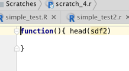
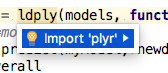
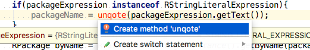
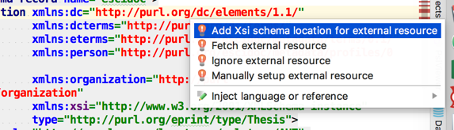
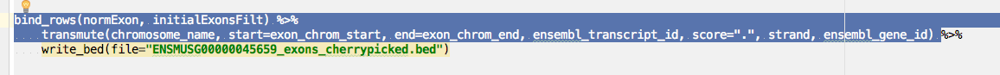
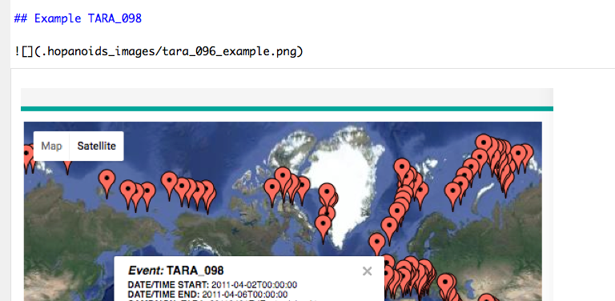
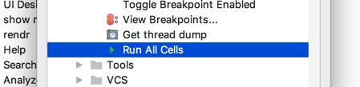
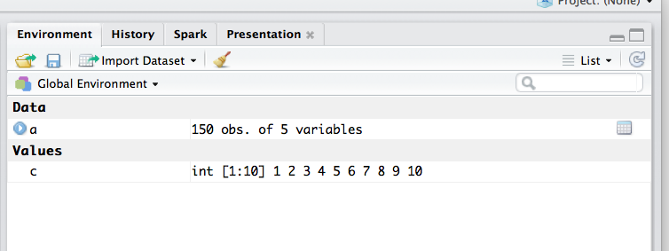

R4Intellij Development Notes
=============================

## 0-day bugs

* regression: unused even if used:
```r
train_glm = function(trainData){   train(is_group_leader ~ ., data = trainData, trControl = trainCtrl, method = "glm")}

trainFunctions = list(
    glm = train_glm,
    glmnet = train_glmnet,
    logit = train_logit,
    rf = train_rf,
    rf_pca = train_rf_pca,
    rf_pp = train_rf_pp,
    C5Tree = train_C5Tree
)

trainFunctions

```

* exception when opening project
```
jaacva.lang.ArrayIndexOutOfBoundsException: 1
	at com.r4intellij.documentation.RHelpParser.<init>(Unknown Source)
	at com.r4intellij.documentation.RDocumentationProvider.getHelpForFunction(Unknown Source)
	at com.r4intellij.documentation.RDocumentationProvider.generateDoc(Unknown Source)
	at com.intellij.lang.documentation.CompositeDocumentationProvider.generateDoc(CompositeDocumentationProvider.java:144)
	at com.intellij.codeInsight.navigation.CtrlMouseHandler.a(CtrlMouseHandler.java:661)
	at com.intellij.openapi.application.impl.ApplicationImpl.runReadAction(ApplicationImpl.java:884)
	at com.intellij.codeInsight.navigation.CtrlMouseHandler.a(CtrlMouseHandler.java:658)
	at com.intellij.util.concurrency.QueueProcessor.runSafely(QueueProcessor.java:223)
	at com.intellij.util.Alarm$Request$1.run(Alarm.java:387)
	at com.intellij.util.Alarm$Request.run(Alarm.java:398)
	at java.util.concurrent.Executors$RunnableAdapter.call(Executors.java:511)
	at java.util.concurrent.FutureTask.run(FutureTask.java:266)
	at com.intellij.util.concurrency.SchedulingWrapper$MyScheduledFutureTask.run(SchedulingWrapper.java:237)
	at com.intellij.util.concurrency.BoundedTaskExecutor$2.run(BoundedTaskExecutor.java:210)
	at java.util.concurrent.ThreadPoolExecutor.runWorker(ThreadPoolExecutor.java:1142)
	at java.util.concurrent.ThreadPoolExecutor$Worker.run(ThreadPoolExecutor.java:617)
	at java.lang.Thread.run(Thread.java:745)
```
* threading issues when doing skeletonization
* null assignments remove columns and should not be flagged as unused if the df is still used
```r
require(datasets)
foo = data.frame() 
foo$bar <- NULL
head(foo)
```

* negative array access shows false-positive warning
```r
splitIndex = 1
trainSplit <- iris[splitIndex,]
testSplit <- iris[-splitIndex,]

## problem is more generic
foo = -splitIndex

```

* function inlineing is broken
```r
train_glm = function(trainData){   train(is_group_leader ~ ., data = trainData, trControl = trainCtrl, method = "glm")}

list(
pdModel = model_glmnet
)
```

## Next Steps

* process forum replies

* **fix basic formatting**

* fix resolver for unquoted variable names see [here](../misc/devel_notes.md)

* formula show up ans non-resolvable: `pw_present~.`

* implement pipe support

* remove deprecated api usage

* resolve all infix op and tag as unresolved


### v1.0

* add "new r script" and "add new R-notebook" context menu entries (see /Users/brandl/projects/rplugin/BashSupport/src/com/ansorgit/plugins/bash/actions/NewBashFileAction.java)
    * also see org.jetbrains.plugins.groovy.actions.NewScriptAction
    * templates for notebook, shiny, blank, r presentation io-slides (with regular notebook preview)
* replace RPackage service with on-the-fly model using stub-index (is possible because they still miss function titles)
  
### v1.1

http://www.jetbrains.org/intellij/sdk/docs/reference_guide/custom_language_support/additional_minor_features.html


* fix gradle build to include resource files in zip (see https://github.com/JetBrains/gradle-intellij-plugin/issues/180#issuecomment-280377767) 
* improve test coverage, see http://www.jetbrains.org/intellij/sdk/docs/tutorials/writing_tests_for_plugins/reference_test.html
* [parameter info](https://intellij-support.jetbrains.com/hc/en-us/community/posts/206791995-Parameter-Info)

* better error recovery in parser (see https://github.com/JetBrains/Grammar-Kit#attributes-for-error-recovery-and-reporting)
* more rigorous unit test for [operator presedence](https://stat.ethz.ch/R-manual/R-devel/library/base/html/Syntax.html)


Intentions & inspections
------------------------


### call arguments 
 
* add intention to name function argument (just current or all in function call)

* intention to add unresolved arg in function expression as named parameter
 

* show correct warning if too many args are provided 
```r
log(1,2,3,4)
```

* intention to add name to named argument `myfun(34)` ->  `myfun(num_reps = 34)`  

### best practices & coding style

* inspection to replace `<-` with `=`
   
* intention to replace tidyverse imports with library(tidyverse)

* Intention to surround if expression list selection with curly brackets
    * "add braces for if/else statement" intention

* inspection: warn about usage of T and F

* warn about assignment usage when boolean result is expected:
```r
if(a=3){}
filter(iris, Species="setosa")
subset(iris, Species="setosa")

## Note: technially certain assignment can evaluate to boolean
if(a=(function(){T})()){ print("foo")}
## but this seems very bad practice and should be flagged as well
```

### dependency management


* somehow offer detach as option to resolve namespace conflicts
```r
detach("package:tibble", unload=TRUE)
```
* in addition to import also offer "use namespace call"



* create unresolved function quickfix 

* create missing function intention (by considering   
    * see `codeInsight.unresolvedReferenceQuickFixProvider implementation="com.intellij.psi.impl.source.resolve.reference.impl.providers.SchemaReferenceQuickFixProvider"`)
    * use: `QuickFixFactory.getInstance().createAddMethodFix() ` (see https://intellij-support.jetbrains.com/hc/en-us/community/posts/206142769-Triggering-Create-Method-intention )
```r
result = myfancyfun(sdf)  ### show myfancyfun in RED

## intention should change it into
myfancyfun = function(sdf){
    .caret.
}
result = myfancyfun(sdf)  

```


* highlight packages with naming conflicts (or indicate it visually in the IDE using virtual comment)


* unresolved package methods should show as error (as do non-imported java methods/classes)

* inspection in case of naming conflicts (same functions in imported packages) suggest to add prefix to method call (allow to override by annotation)
    * show warning just for overridden symbols


### piping support

* warn about dataframe arguments in pipe
```r
iris %>% mutate %>% ggplot(iris, aes())
iris %>% mutate %>% transmute(iris, avg_length=mean(Length))
```

* quick fix to simplify/ remove the dot in  `filtGraphData %>% graph.data.frame(., directed=TRUE)` if first arg

* inspection for highly cascaded function calls --> pipe them
    * apply post-fix reformatting of affected code-chunk
    * intention to also pipe simple function arguments (test initial but also non-initial positions)
    * Example: attribute may want to go out
```r 
    geneInfo <- biomaRt::getBM(attributes=c("ensembl_gene_id", "external_gene_name", "description", "gene_biotype"), mart=mart) %>% cache_it()
```

 * also allow to reverse pipes with intention (like non-sense 2 element pipes)
    * `see com.siyeh.ipp.concatenation.MakeCallChainIntoCallSequenceIntention`
 ```r
distinct(x) %>% nrow
# should become
nrow(distinct(x))
```

* warn by non function call use of `%>%`
```
1 %>% 1
Error in function_list[[k]](value) : attempt to apply non-function
```


### Misc

baser to tidyverse intentions
* `read.delim("algn_counts.txt", header=F)` to read_tsv


* highlight use of `return` in assignment as error:
```r
function(){
  asdf = return(1)
}
```
* unit test & inspection to prevent that return is used outside of function_expression

* refac: Introduce parameter to method

* implement NoSideEffectsInspection (see already created unit-test)
    * also make sure to flag plotting in loops etc.
    
* inspection category for best practices. see https://swcarpentry.github.io/r-novice-inflammation/06-best-practices-R/ 

* warn/error if using attribute-setter invokation style on non-attribute-setter method:
```r
nrow(iris) = 0
```

* check if urls and strings that are arguments of readr methods exist (allow to add working dir annotation to configure this locally)
    * http://stackoverflow.com/questions/18134718/java-quickest-way-to-check-if-url-exists
```r
# similar to type annotation
# @type recursive : logical

# Examples: 
# @working-dir ../../
# @working-dir ~/Users/
# @working-dir ${FOO}/bar
```
    

* Intention to add roxygen docu + code basic tag completion for roxygen comments
* Intention to change function to S4 function


Parser
------

* valid `1  + + 1` code but `ggplot() + + ggtitle("foo")` isn't  

* `%<>%` should be treated as some kind of assignment operator 

allow to embed urls. See xml-plugin

 
Documentation provider
----------------------

* add title to package view like in RS:


* also add links to package names to go to cran/bioconductor homepages
* Show parameter info
* function help should be context aware
* provide reference profder for roxygen doc `com.jetbrains.python.documentation.docstrings.DocStringReferenceProvider`

Formatter
---------

* also indent comments in wrapped pipes
```r
varImpsPooled %>%
    filter(! str_detect(feature, "PC")) %>%
    ggplot(aes(feature, Overall)) +
# geom_boxplot() + ## todo this should be inlined
    geom_violin() +
    geom_point(alpha = 0.3) +
    coord_flip()
```
* enter after pipe should inline caret according to current indentation level
see `CodeStyleManager.adjustLineIndent()`

* break lines and indent properly in long ggplot commands like
```
    ggplot(aes(fct_revfreq(mpi_lab), fill=labtype)) + geom_bar() + coord_flip() + ggtitle("pd lab publications") + facet_wrap(~pub_time_category, ncol=3)
```

* ensure proper check indentation when using as pipe sink
```r
pdStories %>%
    filter(!is.na(pub_time_category)) %>%
    group_by(labtype, pub_time_category) %>% summarize(
        total_pubs=n(),
        num_postdocs=unlen(full_name),
        pubs_pdcount_norm=total_pubs/num_postdocs
    ) %>%
    ggplot(aes(labtype, pubs_pdcount_norm)) + geom_bar(stat="identity") + coord_flip() + ggtitle("pd lab publications normalized by total postdocs in categories") + facet_wrap(~pub_time_category, ncol=3)

```

* post fix template support https://www.jetbrains.com/help/idea/2016.3/using-postfix-templates.html

Completion Provider
-------------------


* dollar completion for environment variables
```
# dynamic via object introspection
iris$Sep<caret>

## static comes via regular word completion
iris$foo = 34
iris$f<caret>
```

* method names after <package>:: 
    * use dot-autocompletion https://intellij-support.jetbrains.com/hc/en-us/community/posts/206139359-Autopopup-code-completion-in-custom-language
    
* after function name completion, cursor should end up between brackets

* show library import suggestions also for infix operators (like %<>% --> magrittr) 
```r
iris %$% Species ## so what?

```

* intention to remove unused parameter from method signature


* Make use of CompletionType enum to finetune/speed up auto-completion

* provide completion for named function parameters
* help for function parameter should open function help

* general method name completion with autoimpart
```
com<complete> # show all methods which start with com including their packacke prefix --> autoimport if not done is completion is accepted 
```
    * preference schemes for certain packages (dplyr, ggplot, etc)
* better File path completion for nested directories

* if running with console
    * complete environment variables
    * filter(iris, Species=="<complete here>")

Refactorings
------------

* **FIXME**: renaming for loop variables is broken
```r
for (name in packageNames) {
    if (paste(name, "r", sep=".") %in% list.files(path=args[1])) {
        next
    }
}
```

* introduce variable for selection: infer name from pipe sink if it's a named argument


* make sure all rstudio refactorings work as well


* resolver should allow to avoid renaming of locally overloaded libray methods. So it should detect local function redefinitions
```r
require(dplyr)

require = function(a) a+1

require(dplyr) ## rename this to foo --> should not touch first import statment
```

* change signature refac
```
    <extensionPoint name="refactoring.changeSignatureUsageProcessor"
                    interface="com.intellij.refactoring.changeSignature.ChangeSignatureUsageProcessor"/>
```
 

* refac to change signature

* surround with try catch block


Rnotebook support
-----------------

dynmaic toolbar buttons
`https://intellij-support.jetbrains.com/hc/en-us/community/posts/206151289-How-to-add-icons-to-the-toolbar-`

* implement new fenceprovider for enhanced RMd snippet injection https://github.com/JetBrains/intellij-plugins/pull/464#event-918221586

Direct md embedding like in Rstudio



are not possible in the intellij editor, see 
https://intellij-support.jetbrains.com/hc/en-us/community/posts/206756045-Displaying-an-image-in-source-code-editor


http://stackoverflow.com/questions/29718926/saving-the-state-of-a-webview-and-reloading-the-position

http://rmarkdown.rstudio.com/r_notebook_format.html

http://rmarkdown.rstudio.com/r_notebooks.html#output_storage


The document’s chunk outputs are also stored in an internal RStudio folder beneath the project’s .Rproj.user folder. If you work with a notebook but don’t have a project open, the outputs are stored in the RStudio state folder in your home directory (the location of this folder varies between the desktop and the server).

* chunks. (should package imports be extrapolated to the complete file to work accross chungs?


https://slides.yihui.name/2017-rstudio-conf-ext-rmd-Yihui-Xie.html#5

https://slides.yihui.name/2017-rstudio-conf-rmarkdown-Yihui-Xie.html#1

http://ijlyttle.github.io/bsplus/

* allow to open notebook in browser
`    <selectInTarget implementation="com.intellij.ide.browsers.actions.SelectInDefaultBrowserTarget"/>
`

* what is the meaning of "run all cells"?



## Environment view 



* open table in idea support (differnt modes: internal, DT)
* integrate with table editor in intellij
* Allow to open table by clicking (R Console session required)

See  https://www.jetbrains.com/help/idea/2016.3/working-with-the-table-editor.html


Package Manger
==============

* **fixme** package installation fails 


Brainstorming
=============

* resolve project sources to source_statemtns OR assume project sources to be always present in project files

* pacakge_summaries.R require network access (via tools::package_dependencies) 

* Connectors for xterm and Rgui on windows
* ColorSettingsPage (see Bash implementation)

*  also support rstudio like sectioning 
* What about packrat? http://rstudio.github.io/packrat/walkthrough.html
* provide `com.intellij.codeInsight.daemon.impl.quickfix.FetchExtResourceAction.FetchExtResourceAction(boolean)` for `devtools::source_url)` statments 


* unit test integration for testhat package (see http://r-pkgs.had.co.nz/tests.html)
    * run tests in directory
    * rerun failed tests
    * run tests in current console?
    
* package development support
    * see http://r-pkgs.had.co.nz/tests.html
    * new package template (or even own module? type) 
    
* `#@r4i-imports` annotation (until we have proper source_url support): 
  ```r
  # @r4i-imports: tidyverse, ggplot
  devtools::source_url("...") # @r4i-imports: tidyverse, ggplot
  ```

* documentation provider improvements 
    * button to open examples in scratch-file
    * use syntax coloring in examples and usage
    
* should we add `    <enterHandlerDelegate implementation="com.intellij.json.formatter.JsonEnterBetweenBracesHandler"/>`

* learn from `/Users/brandl/projects/jb/intellij-community/platform/platform-resources/src/META-INF/JsonPlugin.xml`
    
    
Send To Console Improvements
============================

* mandatory dependency on Send2Console / or add suggestion balloon

Send to Console improvement:
    * send to console: jump to next line after eval (option?) 
    * eval current top-level expression (option?)
    * also add options to send line to current run console instead 
    * later: potentially add separate impl for R4intellij for more smooth integration
    
* shortcut to evaluate current expression and proceed


* R Session has almost complete implementation for console, objects, etc

Windows Support
* I think FindWindow and SendMessage are the functions you want to use, in general.
* Tinn-R: It also pops up additional menu and toolbar when it detects Rgui running on the same computer. These addons interact with the R console and allow to submit code in part or in whole and to control R directly. 
    * It seems to have some limitations
* Maybe DOM is a solution: rdom, RDCOMClient
* Or most promising, we could try to use the windows API via VBScript or C#


Markdown impro wishlist
=======================

* Useful structure view **[done]**
* Click to to jump to code
* synced scrolling
* synced caret http://codepen.io/ArtemGordinsky/pen/GnLBq

* make sure that https://youtrack.jetbrains.com/issue/RUBY-19204 is being fixed or fix it

* aligned cursor with preview
* highlight search results in preview
    * http://stackoverflow.com/questions/19418626/javafx-search-and-highlight-text-add-search-bar-for-loaded-web-page
* search in preview
* intention to unify header styles

* line comment/uncomment see http://stackoverflow.com/questions/4823468/comments-in-markdown. Examples:
<!---
unfortunately doesn't work in GitHub Markdown
-->
[//]: <> (seems more generic) 
[//]: <> (seems more generic) 


Also see [OpenApi notes](openapi_notes.md)
