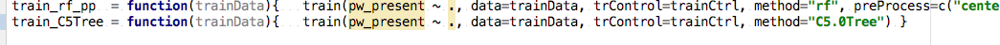

R4Intellij Development Notes
=============================

## 0-day bugs

* incorrect resolver result for function argument


* initial variable declaration should not resolve downwards:
```r
modelData = complete(mice(modelData))
modelData %<>% mutate()
```

* function arguments should be resolved locally
```r
mart <- biomaRt::useDataset("mmusculus_gene_ensembl", mart = biomaRt::useMart("ENSEMBL_MART_ENSEMBL", host="www.ensembl.org"))
geneInfo <- biomaRt::getBM(attributes=c("ensembl_gene_id", "external_gene_name", "description", "gene_biotype"), mart=mart)
```

* dot in pipes should resolve correctly
```r
"foo" %>% paste0(".", ., ".RData")
```

* NA package data in skeleton

```r
NA <- Rsamtools::NA		## NA
```


* argument n is misisn with not default in piped expression
`"foo.bar" %>% str_split_fixed("[.]")`


* don't allow for forward references
```r
require(igraph)
orthoGroupsNoSmes = data_frame(contig=V(orthoGraphNoHsapMmus)$name) 

## forward reference
orthoGraphNoHsapMmus = iris
```

* fix resolver for unquoted variable names see [here](../misc/devel_notes.md:67)

* formula show up ans non-resolvable: `pw_present~.`

* resolved fails to resolve if assignment (what about for, while) ? write unit tests to prevent regressions!
```r
if(T){
a = 3
}
a
```

* import resolveer: support annotation (until we have proper source_url support): 
```r
# @r4i-imports: tidyverse, ggplot
devtools::source_url("...") # @r4i-imports: tidyverse, ggplot
```

* exception when right-click on scratches:
```
update failed for AnAction with ID=ProjectViewPopupMenuRefactoringGroup
java.lang.NullPointerException
	at com.r4intellij.documentation.RDocumentationProvider.isLibraryElement(RDocumentationProvider.java:89)
	at com.r4intellij.psi.references.RenamingVetoCondition.value(RenamingVetoCondition.java:19)
	at com.r4intellij.psi.references.RenamingVetoCondition.value(RenamingVetoCondition.java:15)
	at com.intellij.refactoring.rename.PsiElementRenameHandler.isVetoed(PsiElementRenameHandler.java:210)
	at com.intellij.refactoring.rename.PsiElementRenameHandler.isAvailableOnDataContext(PsiElementRenameHandler.java:204)
	at com.intellij.refactoring.rename.RenameHandlerRegistry.hasAvailableHandler(RenameHandlerRegistry.java:69)
	at com.intellij.refactoring.actions.RenameElementAction.isEnabledOnDataContext(RenameElementAction.java:64)
	at com.intellij.refactoring.actions.BaseRefactoringAction.update(BaseRefactoringAction.java:166)
	at com.intellij.openapi.actionSystem.ex.ActionUtil.performDumbAwareUpdate(ActionUtil.java:122)
	at com.intellij.openapi.actionSystem.ActionGroupUtil.isActionEnabledAndVisible(ActionGroupUtil.java:98)
	at com.intellij.openapi.actionSystem.ActionGroupUtil.isGroupEmpty(ActionGroupUtil.java:43)
	at com.intellij.openapi.actionSystem.ActionGroupUtil.isGroupEmpty(ActionGroupUtil.java:45)
	at com.intellij.openapi.actionSystem.ActionGroupUtil.isGroupEmpty(ActionGroupUtil.java:34)
	at com.intellij.ide.actions.NonTrivialActionGroup.update(NonTrivialActionGroup.java:37)
	at com.intellij.openapi.actionSystem.ex.ActionUtil.performDumbAwareUpdate(ActionUtil.java:122)
	at com.intellij.openapi.actionSystem.impl.Utils.a(Utils.java:188)
	at com.intellij.openapi.actionSystem.impl.Utils.expandActionGroup(Utils.java:139)
	at com.intellij.openapi.actionSystem.impl.Utils.expandActionGroup(Utils.java:86)
	at com.intellij.openapi.actionSystem.impl.Utils.fillMenu(Utils.java:280)
	at com.intellij.openapi.actionSystem.impl.ActionPopupMenuImpl$MyMenu.show(ActionPopupMenuImpl.java:95)
	at com.intellij.ide.ui.customization.CustomizationUtil$2.invokePopup(CustomizationUtil.java:290)
	at com.intellij.ui.PopupHandler.mousePressed(PopupHandler.java:48)
	at java.awt.AWTEventMulticaster.mousePressed(AWTEventMulticaster.java:280)
	at java.awt.AWTEventMulticaster.mousePressed(AWTEventMulticaster.java:279)
	at java.awt.Component.processMouseEvent(Component.java:6532)
	at javax.swing.JComponent.processMouseEvent(JComponent.java:3324)
	at com.intellij.ui.treeStructure.Tree.processMouseEvent(Tree.java:410)
	at com.intellij.ide.dnd.aware.DnDAwareTree.processMouseEvent(DnDAwareTree.java:59)
	at java.awt.Component.processEvent(Component.java:6300)
	at java.awt.Container.processEvent(Container.java:2236)
	at java.awt.Component.dispatchEventImpl(Component.java:4891)
	at java.awt.Container.dispatchEventImpl(Container.java:2294)
	at java.awt.Component.dispatchEvent(Component.java:4713)
	at java.awt.LightweightDispatcher.retargetMouseEvent(Container.java:4888)
	at java.awt.LightweightDispatcher.processMouseEvent(Container.java:4522)
	at java.awt.LightweightDispatcher.dispatchEvent(Container.java:4466)
	at java.awt.Container.dispatchEventImpl(Container.java:2280)
	at java.awt.Window.dispatchEventImpl(Window.java:2750)
	at java.awt.Component.dispatchEvent(Component.java:4713)
	at java.awt.EventQueue.dispatchEventImpl(EventQueue.java:758)
	at java.awt.EventQueue.access$500(EventQueue.java:97)
	at java.awt.EventQueue$3.run(EventQueue.java:709)
	at java.awt.EventQueue$3.run(EventQueue.java:703)
	at java.security.AccessController.doPrivileged(Native Method)
	at java.security.ProtectionDomain$JavaSecurityAccessImpl.doIntersectionPrivilege(ProtectionDomain.java:76)
	at java.security.ProtectionDomain$JavaSecurityAccessImpl.doIntersectionPrivilege(ProtectionDomain.java:86)
	at java.awt.EventQueue$4.run(EventQueue.java:731)
	at java.awt.EventQueue$4.run(EventQueue.java:729)
	at java.security.AccessController.doPrivileged(Native Method)
	at java.security.ProtectionDomain$JavaSecurityAccessImpl.doIntersectionPrivilege(ProtectionDomain.java:76)
	at java.awt.EventQueue.dispatchEvent(EventQueue.java:728)
	at com.intellij.ide.IdeEventQueue.b(IdeEventQueue.java:843)
	at com.intellij.ide.IdeEventQueue._dispatchEvent(IdeEventQueue.java:675)
	at com.intellij.ide.IdeEventQueue.dispatchEvent(IdeEventQueue.java:391)
	at java.awt.EventDispatchThread.pumpOneEventForFilters(EventDispatchThread.java:201)
	at java.awt.EventDispatchThread.pumpEventsForFilter(EventDispatchThread.java:116)
	at java.awt.EventDispatchThread.pumpEventsForHierarchy(EventDispatchThread.java:105)
	at java.awt.EventDispatchThread.pumpEvents(EventDispatchThread.java:101)
	at java.awt.EventDispatchThread.pumpEvents(EventDispatchThread.java:93)
	at java.awt.EventDispatchThread.run(EventDispatchThread.java:82)
```

usually after startup
```
method not implemented
java.lang.Throwable
	at com.intellij.openapi.diagnostic.Logger.error(Logger.java:132)
	at com.intellij.psi.impl.file.PsiPackageBase.getChildren(PsiPackageBase.java:157)
	at com.r4intellij.documentation.RDocumentationProvider.generateDoc(Unknown Source)
	at com.intellij.lang.documentation.CompositeDocumentationProvider.generateDoc(CompositeDocumentationProvider.java:144)
	at com.intellij.codeInsight.navigation.CtrlMouseHandler.a(CtrlMouseHandler.java:661)
	at com.intellij.openapi.application.impl.ApplicationImpl.runReadAction(ApplicationImpl.java:884)
	at com.intellij.codeInsight.navigation.CtrlMouseHandler.a(CtrlMouseHandler.java:658)
	at com.intellij.util.concurrency.QueueProcessor.runSafely(QueueProcessor.java:223)
	at com.intellij.util.Alarm$Request$1.run(Alarm.java:387)
	at com.intellij.util.Alarm$Request.run(Alarm.java:398)
	at java.util.concurrent.Executors$RunnableAdapter.call(Executors.java:511)
	at java.util.concurrent.FutureTask.run(FutureTask.java:266)
	at com.intellij.util.concurrency.SchedulingWrapper$MyScheduledFutureTask.run(SchedulingWrapper.java:237)
	at com.intellij.util.concurrency.BoundedTaskExecutor$2.run(BoundedTaskExecutor.java:210)
	at java.util.concurrent.ThreadPoolExecutor.runWorker(ThreadPoolExecutor.java:1142)
	at java.util.concurrent.ThreadPoolExecutor$Worker.run(ThreadPoolExecutor.java:617)
	at java.lang.Thread.run(Thread.java:745)
```

* fix all unit tests
    * UnusedParameterInspectionTest
    * UnresolvedReferenceInspectionTest
    
Type Tests:
    * ArgumentsMatching
    * TripleDot

* remove deprecated api usage

* help: header and packag eis missing in popup (seems to be minor bug in `com.r4intellij.documentation.RDocumentationUtils.getFormattedString(com.r4intellij.RHelp)`)

* help: "fetching " forever for invalid symbols (like `Species`)

## Next Steps

v1.0
* add "new r script" and "add new R-notebook" context menu entries (see /Users/brandl/projects/rplugin/BashSupport/src/com/ansorgit/plugins/bash/actions/NewBashFileAction.java)
    * templates for notebook, shiny, blank, r presentation io-slides (with regular notebook preview)
* backport colorscheme
* bring back formatter
* fix threading issues when doing indexing 
* create unresolved function intention using `codeInsight.unresolvedReferenceQuickFixProvider implementation="com.intellij.psi.impl.source.resolve.reference.impl.providers.SchemaReferenceQuickFixProvider"`
 


Intentions & inspections
------------------------

* add intention to name function argument (just current or all in funciton call)

* warn about dataframe arguments in pipe
```r
iris %>% mutate %>% ggplot(iris, aes())
iris %>% mutate %>% transmute(iris, avg_length=mean(Length))
```

* create missing function intention
```r
result = myfancyfun(sdf)  # should become

myfancyfun = function(sdf){
    .caret.
}
result = myfancyfun(sdf)  

```


* missing arg inspection does not recognize dplyr piping --> Ignore first arg if right-hand-size of pipe 

* quick fix to simplify/ remove the dot in  `filtGraphData %>% graph.data.frame(., directed=TRUE)` if first arg

* check if urls and strings that are arguments of readr methods exist (allow to add working dir annotation to configure this locally)
    * http://stackoverflow.com/questions/18134718/java-quickest-way-to-check-if-url-exists
```r
# similar to type annotation
# @type recursive : logical

# Examples: 
# @working-dir ../../
# @working-dir ~/Users/
# @working-dir ${FOO}/bar

```


* find better name for "R Type Checker"
 
* show correct warning if too many args are provided 
```r
log(1,2,3,4)
```

* inspection to replace `<-` with `=`
   
* intention to replace tidyverse imports with library(tidyverse)
* intention

* warn if data-frame arguments are not declared in script (with comment annotation option to flag presence). Since this is not possible on a general we could/should provide it for certain APIs like tidyverse --> what about existing missinfref-inspection


* highlight packages with naming conflicts (or indicate it visually in the IDE using virtual comment)

* "add braces for if/else statement" intention
* inspection in case of naming conflicts (same functions in imported packages) suggest to add prefix to method call (allow to override by annotation)
    * show warning just for overridden symbols

* offer quickfix to surround if expression with curly brackets

* Intention to add roxygen docu + code basic tag completion for roxygen comments
* Intention to change function to S4 function

* intention to add name to named argument `myfun(34)` ->  `myfun(num_reps = 34)`  

* warn about assigmnet usage when boolean result is expected
* inspection: warn about usage of T and F

* consider to use `    <codeInsight.unresolvedReferenceQuickFixProvider
                           implementation="com.intellij.psi.impl.source.resolve.reference.impl.providers.SchemaReferenceQuickFixProvider"/>` for better API design
                           
* conider to use `com.intellij.codeInsight.intention.LowPriorityAction` 

* inpsection for highly cascaded function calls --> pipe them
    * apply post-fix reformatting of affected code-chunk
    * intention to also pipe simple function arguments (test inital but also non-inital positions)
    * Example: atribute may want to go out
```r 
    geneInfo <- biomaRt::getBM(attributes=c("ensembl_gene_id", "external_gene_name", "description", "gene_biotype"), mart=mart) %>% cache_it()
```

 * also allow to reverse pipes with intention (like non-sense 2 element pipes)
 ```r
distinct(x) %>% nrow
# should become
nrow(distinct(x))
```

baser to tidyverse intentions
* `read.delim("algn_counts.txt", header=F)` to read_tsv

* intention to add unresolved arg in function expression as named parameter


Parser
------

* valid `1  + + 1` code but `ggplot() + + ggtitle("foo")` isn't  

* `%<>%` should be treated as some kind of assignment operator 
 
Documentation provider
----------------------

* add title to package view like in RS:


* also add links to package names to go to cran/bioconductor homepages
* Show parameter info
* function help should be context aware

Formatter
---------

enter after pipe should inline caret according to current indentation level
see `CodeStyleManager.adjustLineIndent()`

* break lines and indent properly in long ggplot commands like
```
    ggplot(aes(fct_revfreq(mpi_lab), fill=labtype)) + geom_bar() + coord_flip() + ggtitle("pd lab publications") + facet_wrap(~pub_time_category, ncol=3)
```

* ensure proper check indentation when using as pipe sink
```r
pdStories %>%
    filter(!is.na(pub_time_category)) %>%
    group_by(labtype, pub_time_category) %>% summarize(
        total_pubs=n(),
        num_postdocs=unlen(full_name),
        pubs_pdcount_norm=total_pubs/num_postdocs
    ) %>%
    ggplot(aes(labtype, pubs_pdcount_norm)) + geom_bar(stat="identity") + coord_flip() + ggtitle("pd lab publications normalized by total postdocs in categories") + facet_wrap(~pub_time_category, ncol=3)

```

* post fix template support https://www.jetbrains.com/help/idea/2016.3/using-postfix-templates.html

Completion Provider
-------------------


* dollar completion for environment variables
```
# dynamic via object introspection
iris$Sep<caret>

## static comes via regular word completion
iris$foo = 34
iris$f<caret>
```

* method names after <package>:: 
* after function name completion, cursor should end up between brackets

* show library import suggestions also for infix operators (like %<>% --> magrittr) 
```r
iris %$% Species ## so what?

```

* intention to remove unused parameter from method signature


* Make use of CompletionType enum to finetune/speed up auto-completion

* provide completion for named function parameters
* help for function parameter should open function help

* general method name completion with autoimpart
```
com<complete> # show all methods which start with com including their packacke prefix --> autoimport if not done is completion is accepted 
```
    * preference schemes for certain packages (dplyr, ggplot, etc)
* better File path completion for nested directories

* if running with console
    * complete environment variables
    * filter(iris, Species=="<complete here>")

Refactorings
------------

* **FIXME**: renaming for loop variables is broken
```r
for (name in packageNames) {
    if (paste(name, "r", sep=".") %in% list.files(path=args[1])) {
        next
    }
}
```

* introduce variable for selection: infer name from pipe sink if it's a named argument


* make sure all rstudio refactorings work as well


* resolver should allow to avoid renaming of locally overloaded libray methods. So it should detect local function redefinitions
```r
require(dplyr)

require = function(a) a+1

require(dplyr) ## rename this to foo --> should not touch first import statment
```

* change signature refac
```
    <extensionPoint name="refactoring.changeSignatureUsageProcessor"
                    interface="com.intellij.refactoring.changeSignature.ChangeSignatureUsageProcessor"/>
```
 

* refac to change signature

Rnotebook support
-----------------

dynmaic toolbar buttons
`https://intellij-support.jetbrains.com/hc/en-us/community/posts/206151289-How-to-add-icons-to-the-toolbar-`

* implement new fenceprovider for enhanced RMd snippet injection https://github.com/JetBrains/intellij-plugins/pull/464#event-918221586

Direct md embedding like in Rstudio


are not possible in the intellij editor, see 
https://intellij-support.jetbrains.com/hc/en-us/community/posts/206756045-Displaying-an-image-in-source-code-editor


http://stackoverflow.com/questions/29718926/saving-the-state-of-a-webview-and-reloading-the-position

http://rmarkdown.rstudio.com/r_notebook_format.html

http://rmarkdown.rstudio.com/r_notebooks.html#output_storage


The document’s chunk outputs are also stored in an internal RStudio folder beneath the project’s .Rproj.user folder. If you work with a notebook but don’t have a project open, the outputs are stored in the RStudio state folder in your home directory (the location of this folder varies between the desktop and the server).

* chunks. (should package imports be extrapolated to the complete file to work accross chungs?


https://slides.yihui.name/2017-rstudio-conf-ext-rmd-Yihui-Xie.html#5

https://slides.yihui.name/2017-rstudio-conf-rmarkdown-Yihui-Xie.html#1

http://ijlyttle.github.io/bsplus/

* allow to open notebook in browser
`    <selectInTarget implementation="com.intellij.ide.browsers.actions.SelectInDefaultBrowserTarget"/>
`

* what is the meaning of "run all cells"?


## Environment view 


* open table in idea support (differnt modes: internal, DT)
* integrate with table editor in intellij
* Allow to open table by clicking (R Console session required)

See  https://www.jetbrains.com/help/idea/2016.3/working-with-the-table-editor.html


Package Manger
==============

* **fixme** package installation fails 


Brainstorming
=============

* Connectors for xterm and Rgui on windows
* ColorSettingsPage (see Bash implementation)

* use gradle build similar to markdown plugin. see http://www.jetbrains.org/intellij/sdk/docs/tutorials/kotlin.html

*  also support rstudio like sectioning 
* What about packrat? http://rstudio.github.io/packrat/walkthrough.html
* provide `com.intellij.codeInsight.daemon.impl.quickfix.FetchExtResourceAction.FetchExtResourceAction(boolean)` for `devtools::source_url)` statments 


* unit test integration for testhat package (see http://r-pkgs.had.co.nz/tests.html)
    * run tests in directory
    * rerun failed tests
    * run tests in current console?
    
* package development support
    * see http://r-pkgs.had.co.nz/tests.html
    * new package template (or even own module? type) 
    
Send To Console Improvements
============================

* mandatory dependency on Send2Console / or add suggestion balloon

Send to Console improvement:
    * send to console: jump to next line after eval (option?) 
    * eval current top-level expression (option?)
    * also add options to send line to current run console instead 
    * later: potentially add separate impl for R4intellij for more smooth integration
    
* shortcut to evaluate current expression and proceed


* R Session has almost complete implementation for console, objects, etc

Windows Support
* I think FindWindow and SendMessage are the functions you want to use, in general.
* Tinn-R: It also pops up additional menu and toolbar when it detects Rgui running on the same computer. These addons interact with the R console and allow to submit code in part or in whole and to control R directly. 
    * It seems to have some limitations
* Maybe DOM is a solution: rdom, RDCOMClient
* Or most promising, we could try to use the windows API via VBScript or C#


Markdown impro wishlist
=======================

* Useful structure view **[done]**
* Click to to jump to code
* synced scrolling
* synced caret http://codepen.io/ArtemGordinsky/pen/GnLBq

* aligned cursor with preview
* highlight search results in preview
* search in preview
* intention to unify header styles

* line comment/uncomment see http://stackoverflow.com/questions/4823468/comments-in-markdown. Examples:
<!---
unfortunately doesn't work in GitHub Markdown
-->
[//]: <> (seems more generic) 
[//]: <> (seems more generic) 


Also see [OpenApi notes](openapi_notes.md)
